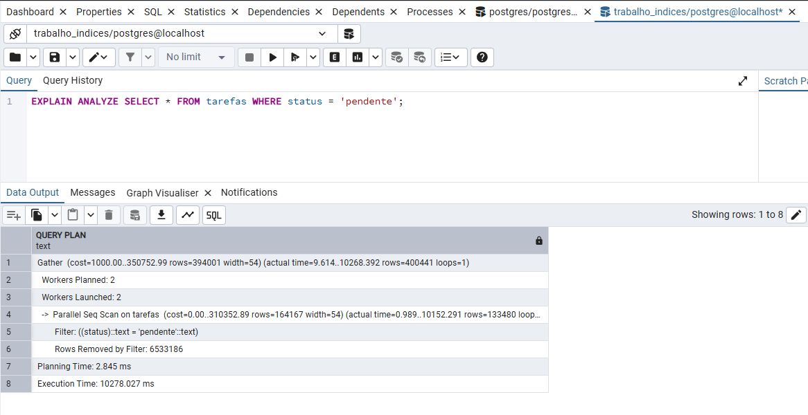
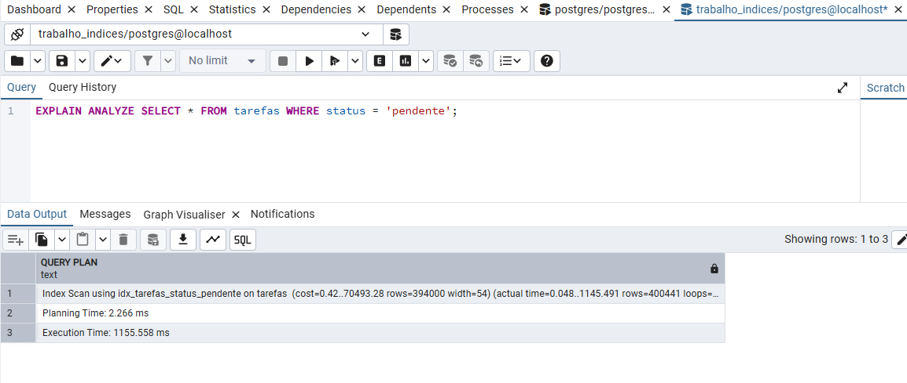
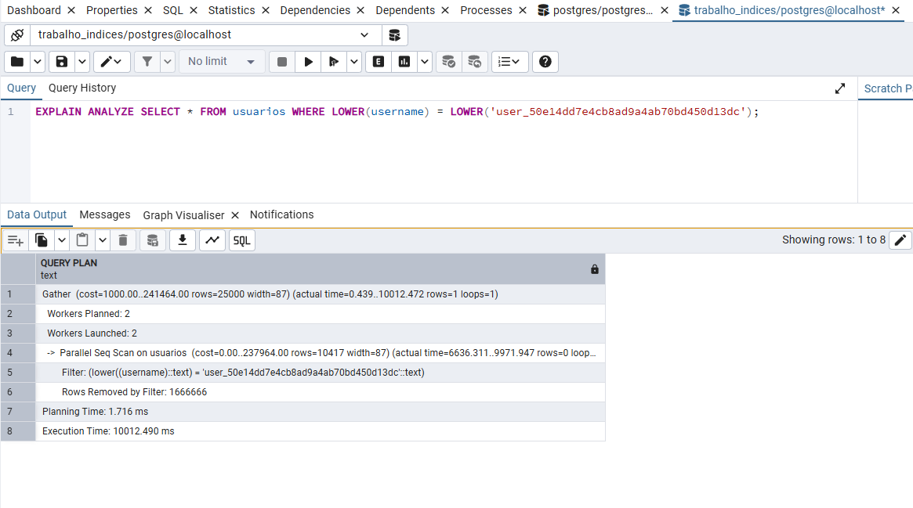
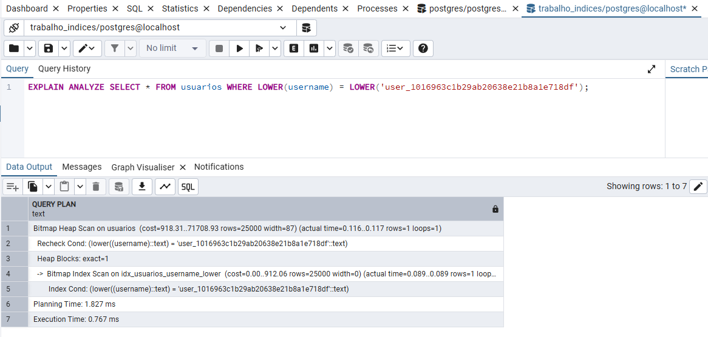

# Otimização de Banco de Dados com Índices Avançados no PostgreSQL

Este repositório contém os artefatos do trabalho da disciplina de PABD (Programação e Administração de Banco de Dados) do curso de Análise e Desenvolvimento de Sistemas.

**Integrantes:**

- Douglas Fernandes
- Gustavo Emanuel
- Hian Sebasthian

## 1. Introdução

O objetivo deste projeto é demonstrar na prática o impacto de duas técnicas de indexação avançada do PostgreSQL: **Índices Parciais** e **Índices em Expressão**. O estudo foi realizado em um banco de dados populado com 20 milhões de registros para simular um cenário de alta volumetria de dados.

## 2. Fundamentação Teórica

### 2.1. Índice Parcial

Um Índice Parcial é um índice construído sobre um subconjunto de linhas da tabela, definido por uma cláusula `WHERE`. Ele é extremamente eficiente para dados com distribuição desigual, pois cria um índice muito menor e mais rápido, contendo apenas as linhas que são frequentemente consultadas por um filtro específico.

### 2.2. Índice em Expressão

Um Índice em Expressão é construído sobre o resultado de uma função ou expressão. Ele permite que o otimizador do PostgreSQL utilize um índice mesmo quando a cláusula `WHERE` de uma consulta aplica uma função a uma coluna (ex: `LOWER(coluna)`), o que normalmente resultaria em um `Seq Scan` lento.

## 3. Demonstração Prática

(Aqui você pode colocar os prints dos seus `EXPLAIN ANALYZE` diretamente no README)

### Cenário 1: Otimizando a busca por `status = 'pendente'`

A consulta inicial sem índice otimizado levou **[10 segundos]**.

Após a criação do Índice Parcial, a mesma consulta passou a levar **[1.1 segundos]**.

### Cenário 2: Otimizando a busca com `LOWER(username)`

A consulta inicial levou **[10 segundos]**.

Após a criação do Índice em Expressão, a consulta passou a levar **[0.7 segundos]**.

## 4. Como Executar os Testes

1. Clone este repositório: `git clone [URL_DO_SEU_REPO]`
2. Crie um banco de dados no seu PostgreSQL (ex: `CREATE DATABASE trabalho_pabd;`).
3. Conecte-se a este banco de dados.
4. Execute os scripts SQL na pasta `/scripts` na seguinte ordem:
   1. `01_criacao_tabelas.sql`
   2. `02_geracao_dados.sql` (Atenção: este script pode levar alguns minutos).
   3. `03_testes_performance.sql` (Observe os planos e tempos de execução).
   4. `04_limpeza_total.sql` (Para apagar as tabelas criadas).

## 5. Conclusão

Este trabalho demonstrou que a aplicação de estratégias de indexação adequadas é uma habilidade essencial para o desenvolvimento de sistemas performáticos e escaláveis. As técnicas de Índice Parcial e Índice em Expressão são ferramentas poderosas no arsenal de um desenvolvedor para resolver gargalos comuns de performance em bancos de dados.
